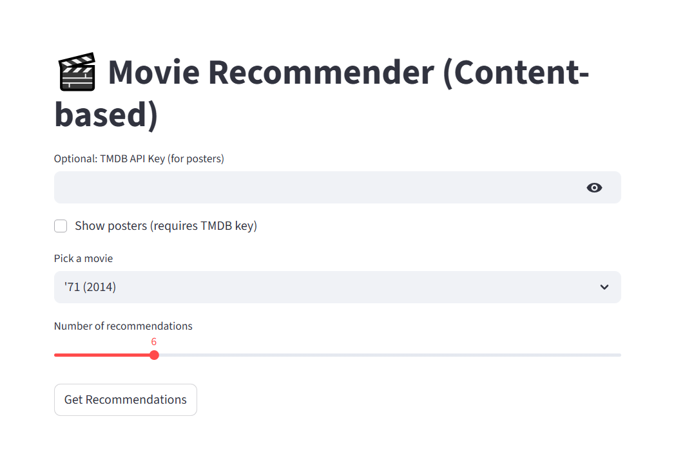
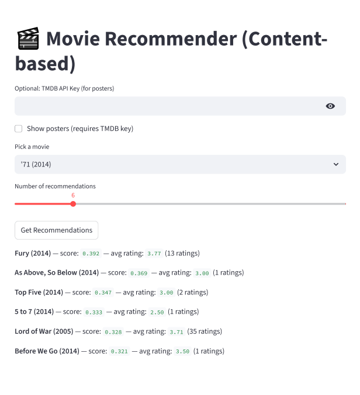

# 🎬 Movie Recommender System (Content-Based)

## Project Overview

This is a **Content-Based Movie Recommender System** built in Python. The system recommends movies similar to a user-selected movie based on **title and genre metadata** using **TF-IDF vectorization** and **cosine similarity**.  

This project was created to demonstrate skills in **Python, data preprocessing, machine learning, and web app deployment**.

---

## Features

- Content-based recommendation using **TF-IDF** and **cosine similarity**.
- Preprocessing includes cleaning titles and genres for accurate matching.
- Interactive web interface using **Streamlit**:
  - Select a movie from a dropdown
  - Choose the number of recommendations
  - Optional: Display movie posters from TMDB API
- Save/load model artifacts using `joblib` and `numpy`.
- Modular, well-structured project for easy extension.

---

## Folder Structure

movie-recommender/
│
├── app/
│ └── streamlit_app.py # Streamlit frontend
├── data/
│ ├── movies.csv # MovieLens dataset
│ └── ratings.csv # Movie ratings
├── models/ # Saved model artifacts (after build)
├── notebooks/
│ └── exploration.ipynb # Data exploration and testing
├── tests/
│ └── test_recommender.py # Unit tests
├── recommender.py # Core recommendation logic
├── requirements.txt # Python dependencies
└── README.md

yaml
Copy code

---

## Screenshots


1. **Home Page / Movie Selection**



2. **Recommendations**



---

## Setup Instructions (Windows)

Follow these steps to run the project locally:

### 1. Clone Repository
```powershell
git clone https://github.com/YOUR_USERNAME/movie-recommender.git
cd movie-recommender
```
### 2. Create Virtual Environment
```powershell
Copy code
python -m venv venv
.\venv\Scripts\Activate.ps1
⚠️ If activation is blocked, run once:

powershell
Copy code
Set-ExecutionPolicy RemoteSigned -Scope CurrentUser
```
### 3. Install Dependencies
```
powershell
Copy code
pip install -r requirements.txt
```
### 4. Download Dataset
```
Go to MovieLens Small Dataset

Download and extract movies.csv and ratings.csv into the data/ folder

```
### 5. Build Model Artifacts
```
powershell
Copy code
python recommender.py
This creates TF-IDF vectors, similarity matrix, and title index in the models/ folder.
```
### 6. Run Streamlit App
```
powershell
Copy code
streamlit run app\streamlit_app.py
Open the URL printed in PowerShell (usually http://localhost:8501)

Select a movie and view recommendations
```
### 7. Run Unit Tests (Optional)
```powershell
Copy code
python -m unittest discover -v
Libraries Used
Library	Purpose
pandas	Data manipulation, reading CSVs
numpy	Numerical operations, saving/loading arrays
scikit-learn	TF-IDF vectorization and cosine similarity
streamlit	Web interface for interactive recommendations
requests	Optional: Fetch movie posters from TMDB
joblib	Save and load model artifacts efficiently
unittest	Unit testing framework
```
### Usage
```Run the Streamlit app

Select a movie from the dropdown

Adjust the number of recommendations

Optional: Input your TMDB API key to show posters

Click "Get Recommendations" to see the top similar movies
```
### Future Improvements
```Integrate collaborative filtering for hybrid recommendations

Include plot summaries, cast, or keywords for better similarity

Deploy online via Streamlit Cloud for portfolio showcase

```
### References
``` MovieLens Dataset

Scikit-learn: TF-IDF Vectorizer

Streamlit Documentation
```
### Author
Chidwan AD
